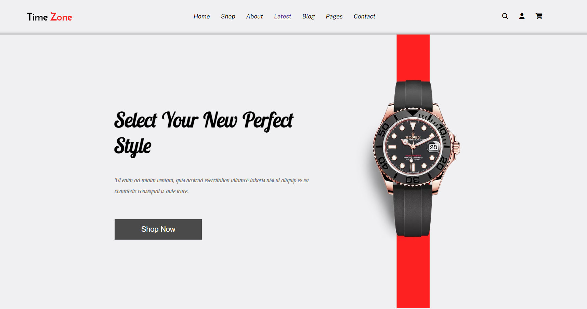

# Watch Store - E-Commerce Website

Welcome to **Watch Store**, a fully responsive e-commerce website designed for selling watches. This project is built using **HTML**, **CSS**, and **JavaScript** to provide a seamless shopping experience.

 <!-- Add a screenshot of your project here -->

## Table of Contents
1. [Features](#features)
2. [Technologies Used](#technologies-used)
3. [Installation](#installation)
4. [Usage](#usage)
5. [Folder Structure](#folder-structure)
6. [Contributing](#contributing)
7. [License](#license)

---

## Features

- **Responsive Design**: The website is fully responsive and works on all devices (desktop, tablet, and mobile).
- **Product Listings**: Display a variety of watches with details like name, price, and description.
- **Shopping Cart**: Add and remove items from the cart with real-time updates.
- **User Authentication**: Login and signup functionality for users.
- **Search Functionality**: Easily search for watches by name or category.
- **Smooth Animations**: CSS animations and transitions for a better user experience.
- **Dropdown Menus**: Interactive dropdown menus for categories and user options.
- **Hamburger Menu**: A toggleable menu for mobile devices.

---

## Technologies Used

- **HTML5**: For structuring the website.
- **CSS3**: For styling and animations.
- **JavaScript**: For interactivity and dynamic content.
- **Font Awesome**: For icons.
- **Google Fonts**: For custom typography.

---

## Installation

To run this project locally, follow these steps:

1. **Clone the repository**:
   ```bash
   git clone https://github.com/your-username/watch-store.git